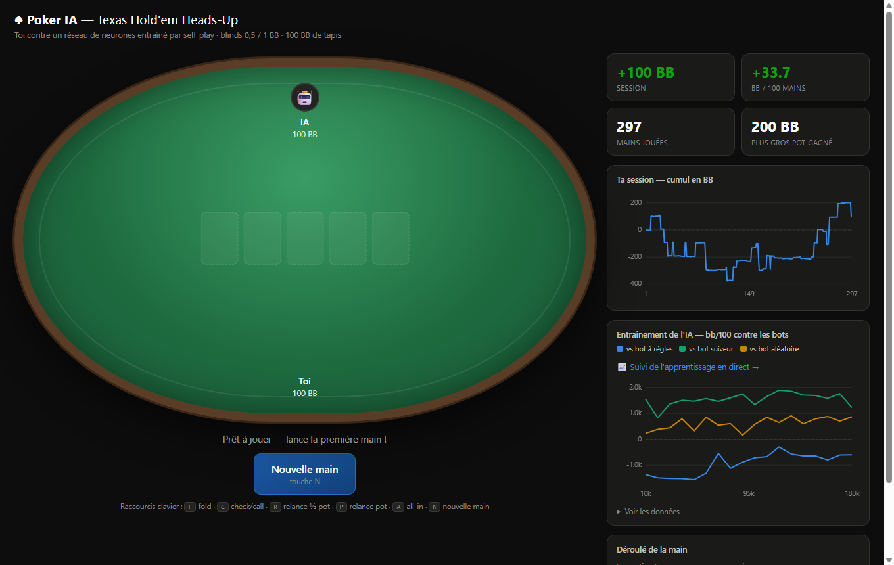
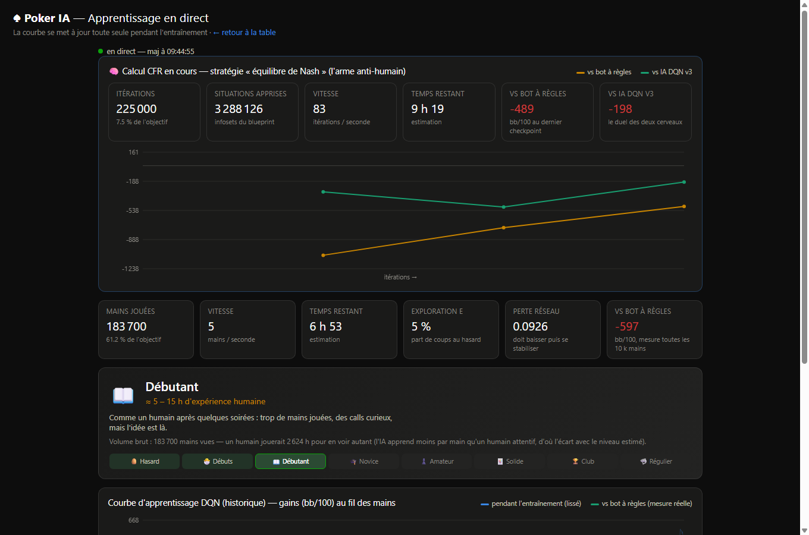

# PokerIA — Texas Hold'em Heads-Up : du Deep Q-Learning à l'équilibre de Nash

[](https://github.com/MartinM-781/PokerIA/actions/workflows/ci.yml)


[](LICENSE)

Une IA de poker écrite en Python avec **NumPy uniquement** — réseau de neurones,
rétropropagation et algorithme MCCFR codés à la main, zéro dépendance lourde.
Le projet a traversé trois générations : un DQN entraîné par self-play, puis un
**blueprint CFR** (la famille d'algorithmes de Libratus) qui calcule une
stratégie proche de l'équilibre de Nash, aujourd'hui en v2 avec une abstraction
consciente des tirages.

> 🤖 **Particularité du projet** : un **agent Claude est branché en « coach »**
> sur l'IA — c'est lui qui conçoit et lance les entraînements, mesure la force
> de chaque génération, audite les mains du bot *cartes visibles* (`audit.py`)
> pour débusquer ses fuites (sur-fold, tirages joués passivement…), et décide
> des évolutions d'architecture sur la base de ces diagnostics. L'historique
> des courbes d'apprentissage est visible sur le dashboard (`/training`).

## 🎮 Jouer sans rien installer

[](https://codespaces.new/MartinM-781/PokerIA?quickstart=1)

Clique sur le badge (compte GitHub requis, gratuit) : un environnement s'ouvre
dans le navigateur. Dans son terminal :

```bash
python server.py
```

…et la table de poker s'ouvre automatiquement. Sans téléchargement
supplémentaire, tu affrontes le cerveau DQN (fourni dans le dépôt). Pour
affronter le **blueprint CFR complet** (le plus fort, ~400 MB), télécharge-le
depuis les [Releases](https://github.com/MartinM-781/PokerIA/releases) et
place-le dans `models/cfr_blueprint.pkl` — le serveur le choisira tout seul.

## Démarrage rapide

```bash
python tests/test_all.py     # vérifier l'installation (~20 s)
python train.py              # entraîner l'IA : 40 000 mains (~20 min)
python server.py             # ⭐ table de poker graphique : http://localhost:8777
python play.py               # ou jouer dans le terminal
python evaluate.py           # mesurer sa force contre 3 bots de référence
```

Un modèle déjà entraîné est fourni dans `models/model.npz` — tu peux jouer
directement avec `python server.py`.

## Aperçu

| La table de jeu | L'apprentissage en direct |
|---|---|
|  |  |

Les **bulletins scolaires** de l'IA — notes par matière (préflop, tirages,
river, discipline) rédigés par le panel de coachs à chaque jalon
d'entraînement — sont archivés dans
[models/coach_reports/](models/coach_reports/).

## Le dashboard (table graphique)

`python server.py` puis ouvre **http://localhost:8777** : une vraie table de
poker dans le navigateur — feutrine, cartes, jetons, bouton dealer, bulle de
dialogue de l'IA — avec un tableau de bord à droite :

- **Tuiles** : gains de session (BB), bb/100, mains jouées, plus gros pot ;
- **Courbe de session** : ton cumul de gains main après main ;
- **Courbe d'entraînement** : la progression de l'IA contre les 3 bots
  (lue depuis `models/metrics.csv`) ;
- **Journal de la main** : chaque action, street par street.

Raccourcis clavier : `F` fold, `C` check/call, `R` relance ½ pot, `P` relance
pot, `A` all-in, `N` nouvelle main. La session est persistée dans
`models/session.json` (bouton de remise à zéro dans le panneau).

## Le jeu

Texas Hold'em **no-limit en tête-à-tête** (heads-up). Chaque main, les deux
joueurs repartent avec 100 BB. Cinq actions possibles : se coucher,
check/call, relance ½ pot, relance pot, all-in.

## Comment l'IA apprend

1. **Features (27 dimensions)** : équité Monte-Carlo, cote du pot, position,
   street, tapis… plus la **texture du board** (board pairé, couleur possible,
   tirages, coordination) et la **lecture de l'agression adverse** (qui relance,
   combien de fois, qui a l'initiative, taille des mises).
2. **Q-Network** : un réseau 27 → 256 → 256 → 5 estime le gain espéré de chaque
   action. En jeu, une **stratégie mixte** (softmax, option `--temperature`)
   mélange les décisions serrées pour rester imprévisible face à un humain.
3. **Deep Q-Learning** : buffer de rejeu (200 k transitions), réseau cible,
   exploration ε-décroissante, Adam avec décroissance du taux d'apprentissage.
4. **Self-play** : l'agent affronte des copies gelées de lui-même, un bot à
   règles, un **bot maniaque hyper-agressif** (pour apprendre à payer les
   bluffs), un bot suiveur et un bot aléatoire.

## Structure du projet

| Fichier | Rôle |
|---|---|
| [poker_ai/evaluator.py](poker_ai/evaluator.py) | Évaluateur de mains 7 cartes, vectorisé NumPy |
| [poker_ai/equity.py](poker_ai/equity.py) | Équité par Monte-Carlo (milliers de tirages en quelques ms) |
| [poker_ai/game.py](poker_ai/game.py) | Moteur de jeu heads-up no-limit (blinds, streets, all-in, abattage) |
| [poker_ai/features.py](poker_ai/features.py) | État du jeu → vecteur de 27 features |
| [poker_ai/network.py](poker_ai/network.py) | MLP + backprop + Adam en NumPy pur |
| [poker_ai/agent.py](poker_ai/agent.py) | Agent DQN, buffer de rejeu, bots de référence |
| [poker_ai/training.py](poker_ai/training.py) | Boucle de self-play et évaluation périodique |
| [server.py](server.py) | Serveur du dashboard (API JSON + table graphique) |
| [web/](web/) | Frontend : table de poker, graphiques canvas, journal |
| [train.py](train.py) / [play.py](play.py) / [evaluate.py](evaluate.py) | Scripts en ligne de commande |
| [tests/test_all.py](tests/test_all.py) | Tests : évaluateur vs référence naïve, équités, invariants du moteur |

## Options utiles

```bash
python train.py --hands 300000 --hidden 256 --sims 128   # entraînement « fort » (~3 h)
python play.py  --sims 800                # IA plus réfléchie en jouant
python server.py --temperature 0          # IA 100 % déterministe (plus exploitable)
python evaluate.py --hands 10000          # mesure plus fiable (± plus petit)
```

L'entraînement écrit `models/metrics.csv` (courbe de progression) et
sauvegarde le modèle à chaque évaluation — on peut l'interrompre avec Ctrl+C
sans rien perdre.

## Le blueprint CFR — l'IA « équilibre de Nash »

Le DQN apprend une *meilleure réponse* à ses adversaires d'entraînement — un
humain fort finit par l'exploiter. Le **MCCFR** (Monte-Carlo Counterfactual
Regret Minimization, la famille d'algorithmes de Libratus) calcule à la place
une stratégie proche de l'**équilibre de Nash** du jeu : mixte par nature,
sans fuites structurelles, impossible à « lire ».

```bash
python train_cfr_parallel.py --workers 4   # calcul parallèle (recommandé, ~3× plus vite)
python train_cfr.py                        # variante mono-cœur (--resume pour reprendre)
python evaluate.py --model models/cfr_blueprint.pkl   # force du blueprint (y c. vs DQN)
python audit.py                            # mode coach : révision de mains, cartes visibles
python server.py                           # sert automatiquement le meilleur cerveau disponible
```

Le calcul parallèle reprend automatiquement le blueprint existant et le met à
jour par cycles atomiques : on peut l'interrompre et le relancer sans perte.

Abstraction : 169 classes préflop exactes ; postflop, buckets d'équité
Monte-Carlo (12 niveaux) + texture du board. Suivi dans
`models/cfr_progress.csv` et `models/cfr_metrics.csv` (force mesurée contre le
bot à règles et contre le DQN v3 à chaque checkpoint).

## Performances — le cœur compilé (Rust)

Le chemin chaud du MCCFR (moteur de jeu, évaluateur 7 cartes, équité
Monte-Carlo, buckets, traversée) existe en deux implémentations :

| Cœur | Vitesse mesurée (1 ouvrier) | |
|---|---|---|
| Python pur (NumPy) | 33 it/s | référence, toujours disponible |
| **Rust (poker_native)** | **3 030 it/s** | **×93** — mesuré sur 5 000 itérations, i7-13700H |

La parité est validée par une batterie stricte : scores de l'évaluateur
**identiques au bit près** sur 100 000 tirages, moteur de jeu **identique au
jeton près** sur 10 000 séquences rejouées pas à pas, clés d'infoset octet
pour octet (169 classes préflop, drapeaux de tirage), équité à ±0,011.
Les blueprints sont interchangeables entre les deux cœurs (même pickle).

```bash
# compiler le cœur natif (Rust + maturin ; toolchain GNU, pas besoin de MSVC)
cd native && maturin build --release && pip install target/wheels/poker_native-*.whl

# entraîneur natif recommandé : mono-processus, ouvriers = threads Rust
# fusionnés en RAM. Aucun fichier ouvrier sur le disque, un seul checkpoint par cycle.
python train_cfr_native.py --workers 6 --chunk 250000

# variante multi-processus (repli Python pur possible via --engine python)
python train_cfr_parallel.py --workers 3 --chunk 250000
```

### Empreinte disque

L'ancien découpage multi-processus écrivait **une copie complète du blueprint
par ouvrier à chaque cycle** (6 × ~430 Mo), plus la fusion — soit plusieurs Go
d'écritures par cycle. L'entraîneur natif garde la table vivante côté Rust et
ne touche au disque que pour le blueprint (**une écriture par cycle**), avec la
fusion des threads faite en mémoire (parité bit à bit vérifiée avec l'ancienne
fusion sur disque).

## Limites et pistes d'amélioration

- Le DQN produit une stratégie **déterministe** : très solide contre des bots,
  mais un humain attentif peut repérer des patterns (il ne « mixe » pas ses
  ranges comme le ferait une stratégie d'équilibre de Nash).
- Pistes : ajouter l'historique complet des mises aux features, passer à
  **NFSP** ou **Deep CFR** (les algorithmes des IA championnes comme Libratus
  et Pluribus), gérer des tapis variables ou des tables à plus de 2 joueurs.
